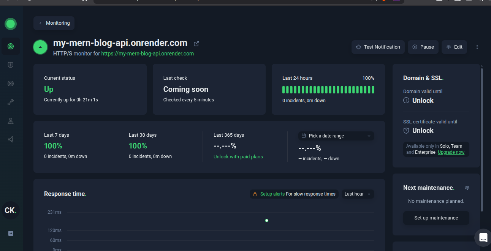

# Application Monitoring Setup

## Tool: UptimeRobot
We are using UptimeRobot to monitor the health of the Backend API.

- **Monitor Type:** HTTP(s)
- **Target URL:** https://my-mern-blog-api.onrender.com/health (or root URL)
- **Check Interval:** Every 5 minutes
- **Alert Contact:** Email Notification

## Evidence
